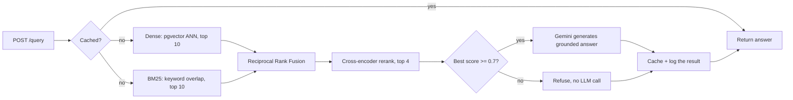
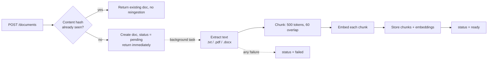

# DocuMind

A multi-tenant document Q&A API. Upload PDFs, Word docs, or text files, ask
questions in plain English, and get answers grounded in the actual content,
with the source chunks cited and a hard refusal when the documents don't
have the answer.

API live at [documind-oyhv.onrender.com](https://documind-oyhv.onrender.com).
Landing page and working demo at
[documind-krapansh.vercel.app](https://documind-krapansh.vercel.app).
Render's free tier sleeps after inactivity, so the first request after a
while can take 30 to 50 seconds to wake it up.


```bash
curl -X POST https://documind-oyhv.onrender.com/auth/keys \
  -H "Content-Type: application/json" \
  -d '{"tenant_name": "demo"}'

curl -X POST https://documind-oyhv.onrender.com/documents \
  -H "X-API-Key: <key from above>" \
  -F "file=@handbook.pdf"

curl -X POST https://documind-oyhv.onrender.com/query \
  -H "X-API-Key: <key from above>" \
  -H "Content-Type: application/json" \
  -d '{"question": "What is the refund policy?"}'
```

## What makes this different from a tutorial RAG app

- **Tenant isolation is enforced in SQL**, not checked after the fact in
  Python. Every query filters by `tenant_id` inside the database call itself.
- **Retrieval combines two strategies**, dense embeddings and keyword search
  (BM25), instead of trusting one.
- **The system refuses to answer** when retrieval confidence is low, instead
  of letting the LLM guess.
- **Quality is measured offline** with a real RAGAS evaluation harness,
  instead of eyeballing a few examples.

## Architecture

One FastAPI service, layered like a much bigger system would be: routers
handle HTTP only, services hold the logic, repositories are the only code
allowed to touch the database, and clients wrap every external API call.
Services never import SQLAlchemy directly. That constraint is what keeps
the retrieval pipeline unit-testable without a live Postgres instance.


Vectors and metadata live in the same Postgres database via `pgvector`,
not a separate vector store. A document, its chunks, and their embeddings
all commit in one transaction, so there is no dual-write problem where a
chunk exists but its embedding failed to save.

## Project layout

```
documind/
├── app/
│   ├── api/routers/          # auth, documents, query, history, eval, health
│   ├── clients/               # Gemini, FlashRank wrappers
│   ├── core/                  # exception hierarchy, security helpers
│   ├── middleware/             # correlation-id, auth, rate-limit
│   ├── models/                 # SQLAlchemy ORM models
│   ├── repositories/           # the only layer allowed to touch the database
│   ├── schemas/                 # Pydantic request/response models
│   ├── services/                 # business logic and orchestration
│   ├── config.py                 # env-driven settings
│   └── main.py                   # app wiring, startup sweep
├── alembic/versions/               # schema migrations
├── eval/
│   ├── golden_corpus/               # 10 fictional source documents
│   ├── golden_dataset.json          # 41 question/answer/category items (v3)
│   ├── run_eval.py                  # CLI entry point for an offline eval run
│   └── RESULTS.md                   # eval history and threshold-tuning notes
├── tests/                             # 19 files, 73 tests, real Postgres
├── frontend/                           # React + Vite landing page and demo
│   ├── src/                             # components, scroll animation, api client
│   └── api/                             # Vercel proxy: session cookie, no client-side key
├── .github/workflows/ci.yml             # GitHub Actions with a real pgvector container
├── Dockerfile / docker-compose.yml / render.yaml
└── requirements.txt
```

## How a query works



Dense retrieval (embedding similarity) is good at semantic matches and bad
at exact terms, like an error code or ticket number. BM25 is the opposite:
strong on keyword overlap, blind to paraphrasing. Reciprocal Rank Fusion
merges the two ranked lists by position, not raw score, since cosine
distance and a BM25 score are not on comparable scales.

The fused candidates go through a real cross-encoder rerank (question and
chunk read together in one pass), which is too slow to run over a whole
corpus but cheap over the handful RRF narrows to. If the best-reranked
chunk still scores below the confidence threshold, the system refuses
before the LLM is ever called, so a refusal costs nothing beyond retrieval.
The system prompt also tells the model to treat retrieved text as data,
never as instructions, so a document containing "ignore previous
instructions" cannot hijack the response.

## How ingestion works



Upload returns immediately with a `pending` status. Chunking, embedding,
and storage run in a background task, since embedding a large document can
take longer than a client should wait synchronously. The client polls
`GET /documents/{id}` for `ready` or `failed`. Re-uploading identical
content is a no-op by content hash, so it never burns embedding calls twice.
Uploads are capped at 20MB, read in bounded chunks rather than one
in-memory `read()` call, since the backend is directly reachable and runs
on a memory-limited instance.

## Multi-tenancy

Every table except `tenants` carries a `tenant_id`, and every query filters
on it inside the SQL, in the repository layer, never as a post-fetch filter
in Python. A post-fetch filter is one deleted line away from leaking
another tenant's data; a query that never had those rows in its result set
cannot leak them regardless of what the calling code does. This is tested
directly: two tenants get chunks with the identical embedding vector on
purpose, so a passing test proves the `tenant_id` filter is what keeps them
apart, not a coincidence of vector distance.

## Evaluation

A hand-built golden dataset against a fictional ten-document corpus.
`eval/run_eval.py` runs every item through the real production retrieval
and answering functions, not a reimplementation, and scores the results
with RAGAS.

| Metric | Score (v2 dataset, 30 items) |
|---|---|
| Faithfulness | 1.0 |
| Answer relevancy | 0.83 |
| Context precision | 0.79 |
| Refusal accuracy | 6/6 (100%) |

The confidence threshold was tuned against measured data, not picked by
hand: an earlier guess correctly refused 3 of 6 genuinely unanswerable
questions, and retuning brought that to 6 of 6 with zero change to answer
quality on the 24 answerable questions. Full history is in
[`eval/RESULTS.md`](eval/RESULTS.md).

That 1.0 faithfulness score is real but easy to over-read. Every v2 answer
is close to a verbatim echo of one source sentence, and every refusal item
is on a topic with no lexical overlap to the corpus at all, so neither
number is tested anywhere near its real boundary. The dataset is now v3
(41 items): it adds questions that need arithmetic the corpus never states,
questions that share vocabulary with a real sentence but ask about the
excluded case, questions that require comparing two documents against each
other, multi-hop questions that need elimination across chunks, and
near-miss refusals that are topically adjacent to real content instead of
unrelated to it. No run has scored v3 yet since that costs real,
rate-limited Gemini quota.

## Security and reliability decisions

- **The public demo used to share one API key** across every visitor,
  baked into the client bundle. Since retrieval is scoped by tenant, one
  key meant one shared tenant, so one visitor's uploads were retrievable
  by anyone else's questions. Fixed architecturally: a same-origin Vercel
  proxy (`frontend/api/`) mints a fresh, isolated tenant per visitor and
  holds its key in an httpOnly cookie the browser never sees. Each new
  tenant clones the seed corpus's chunks and embeddings by value, at zero
  embedding cost, so a fresh visitor can ask a question immediately.
- **The demo-session mint endpoint is rate-limited by IP**, but a client
  can set `X-Forwarded-For` to anything, and every request relayed through
  the proxy used to look like it came from the proxy's own shared egress
  IP. The backend now only trusts a forwarded visitor IP when it is paired
  with a shared secret known only to the proxy, so a direct caller cannot
  forge a fresh IP, and real visitors no longer collide on one bucket.
- **`POST /eval/runs` is closed to ephemeral demo tenants.** It ingests
  the golden corpus and fires real Gemini calls, and demo tenants are free
  to mint, so leaving it open would let anyone script quota exhaustion.
- **A generation failure now returns a clean 503** and is still logged to
  `query_logs`, instead of an unhandled 500 that left no trace and never
  hit the cache with a poisoned answer.
- **Ephemeral tenants are swept on every app boot**, in addition to the
  existing sweep on new demo traffic, since Render has no cron and an idle
  instance would otherwise leave abandoned tenants around indefinitely.
- **The reranker used to be a PyTorch CrossEncoder**, which cost about
  555MB of memory just to load, over Render free tier's 512MB ceiling.
  Replaced with `flashrank` (ONNX Runtime, same class of model), which
  costs about 120MB. The confidence threshold was retuned to match, since
  flashrank's scores are a 0 to 1 scale, not the old raw logits.

## Tech stack

- **API**: FastAPI, Pydantic
- **Database**: PostgreSQL with `pgvector`, SQLAlchemy, Alembic
- **Retrieval**: pgvector cosine similarity (dense), `rank-bm25` (sparse),
  Reciprocal Rank Fusion, FlashRank (ONNX cross-encoder rerank)
- **LLM and embeddings**: Google Gemini (`gemini-embedding-001`,
  `gemini-3.1-flash-lite`)
- **Evaluation**: RAGAS, against a hand-built golden dataset
- **Testing**: pytest, real Postgres in CI, not a mocked DB
- **Deployment**: Docker, Render

## API overview

| Endpoint | Purpose |
|---|---|
| `POST /auth/keys` | Create a tenant and issue an API key |
| `POST /auth/keys/revoke` | Revoke the calling key (self-service only) |
| `POST /auth/demo-session` | Mint an ephemeral, isolated tenant for the public demo |
| `POST /documents` | Upload a document (`.txt`, `.pdf`, `.docx`) |
| `GET /documents` | List the requesting tenant's documents |
| `GET /documents/{id}` | Check ingestion status |
| `DELETE /documents/{id}` | Delete a document and its chunks |
| `POST /query` | Ask a question, get an answer with cited sources |
| `GET /query/stream` | Same as above, streamed token by token over SSE |
| `GET /history/{session_id}` | Prior questions and answers in a session |
| `POST /eval/runs` | Kick off an offline RAGAS evaluation run |
| `GET /eval/runs/{id}` | Read back a completed evaluation run's scores |

Every endpoint except `/auth/keys`, `/auth/demo-session`, and `/health`
requires an `X-API-Key` header. Interactive docs are at `/docs` on any
running instance.

## Running locally

```bash
docker compose up -d          # Postgres + pgvector on port 5433
python -m venv venv
venv\Scripts\activate         # or `source venv/bin/activate` on Linux/macOS
pip install -r requirements.txt
alembic upgrade head
uvicorn app.main:app --reload
```

You'll need a `.env` with `DATABASE_URL` and `GEMINI_API_KEY` set. See
`.env.example`.

## Running tests

```bash
pytest -m "not live_api"
```

73 tests, run against a real Postgres instance, covering multi-tenant
isolation, the full retrieval funnel, ingestion, caching, rate-limiting,
the refusal path, the ephemeral demo tenant lifecycle, and the abuse-surface
fixes above. One test is marked `live_api` and hits the real Gemini
embedding endpoint as a smoke test; it is excluded from CI since it costs
real quota and is not deterministic.

## Known limitations at real scale

- The exact-match query cache and the rate limiters are per-process,
  in-memory state. Correct for one instance, wrong the moment there is
  more than one; a real deployment needs Redis or similar.
- BM25 rebuilds its index from scratch on every query, since `rank-bm25`
  has no persistent index. Fine at demo scale; at real scale this would
  move into Postgres itself with a `tsvector` column and a GIN index.
- The reranker's ONNX model downloads to `/tmp` on first use rather than
  being baked into the Docker image. Fine for a free-tier deployment where
  image size and cold-start memory both matter.
- There is no per-document filter on queries; every query searches a
  tenant's entire ready corpus. A deliberate scope decision, not an
  oversight.
