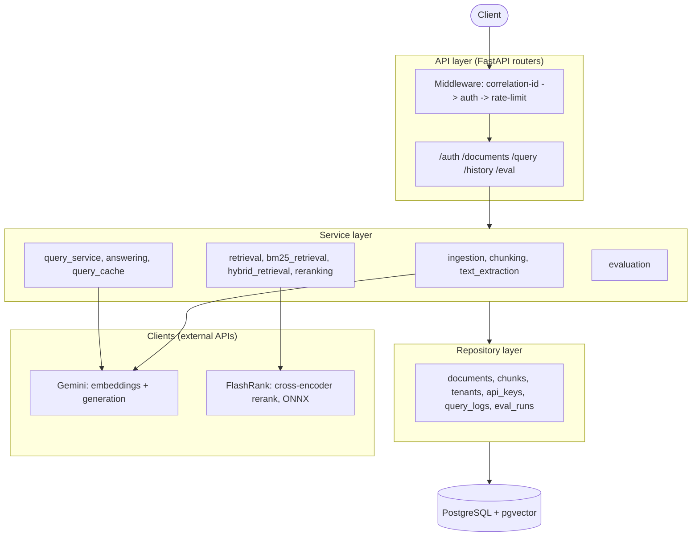
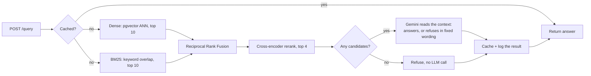
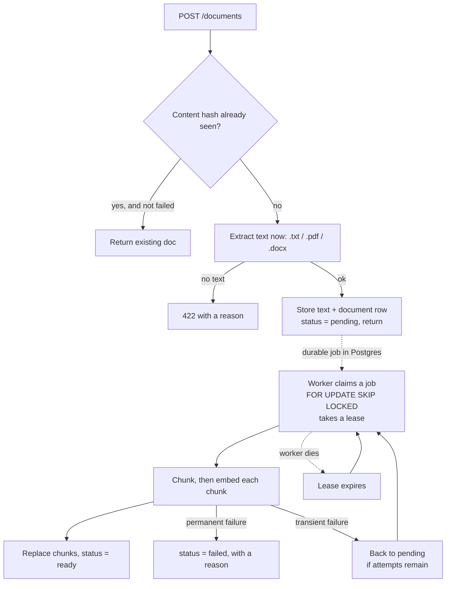

# DocuMind

A multi-tenant document Q&A API. Upload PDFs, Word docs, or text files, ask
questions in plain English, and get answers grounded in the actual content,
with sources cited and a hard refusal when the answer isn't in the documents.

API live at [documind-oyhv.onrender.com](https://documind-oyhv.onrender.com).
Landing page and demo at
[documind-krapansh.vercel.app](https://documind-krapansh.vercel.app).
The backend sleeps after inactivity on Render's free tier, so the first
request can take 30 to 50 seconds.


```bash
curl -X POST https://documind-oyhv.onrender.com/auth/keys \
  -H "Content-Type: application/json" \
  -d '{"tenant_name": "demo"}'

curl -X POST https://documind-oyhv.onrender.com/documents \
  -H "X-API-Key: <key from above>" \
  -F "file=@handbook.pdf"

curl -X POST https://documind-oyhv.onrender.com/query \
  -H "X-API-Key: <key from above>" \
  -H "Content-Type: application/json" \
  -d '{"question": "What is the refund policy?"}'
```

## What makes this different from a tutorial RAG app

- **Tenant isolation lives in SQL**, not in application code. Every query
  filters by `tenant_id` inside the database call itself.
- **Retrieval combines two methods**: dense embeddings and keyword search
  (BM25), instead of trusting one.
- **The system refuses to answer** when the documents do not contain the
  answer, instead of guessing. That decision is made by the model reading the
  retrieved text, after a score threshold was measured to be doing it badly
  in both directions.
- **Quality is measured offline** with a real RAGAS evaluation harness,
  not by eyeballing a few examples.

## Architecture

One FastAPI service, layered the way a much bigger system would be: routers
handle HTTP, services hold the logic, repositories are the only code that
touches the database, and clients wrap every external API call. Services
never import SQLAlchemy directly, which is what keeps the retrieval
pipeline testable without a live Postgres instance.



Vectors and metadata live in the same Postgres database through `pgvector`,
not a separate vector store. A document, its chunks, and their embeddings
commit in one transaction, so a chunk can never exist without its
embedding.

## Project layout

```
documind/
├── app/
│   ├── api/routers/          # auth, documents, query, history, eval, health
│   ├── clients/               # Gemini, FlashRank wrappers
│   ├── core/                  # exception hierarchy, security helpers
│   ├── middleware/             # correlation-id, auth, rate-limit
│   ├── models/                 # SQLAlchemy ORM models
│   ├── repositories/           # the only layer allowed to touch the database
│   ├── schemas/                 # Pydantic request/response models
│   ├── services/                 # business logic and orchestration
│   ├── config.py                 # env-driven settings
│   └── main.py                   # app wiring, startup sweep
├── alembic/versions/               # schema migrations
├── eval/
│   ├── golden_corpus/               # 10 fictional source documents
│   ├── golden_dataset.json          # 41 question/answer/category items (v3)
│   ├── run_eval.py                  # CLI entry point for an offline eval run
│   └── RESULTS.md                   # eval history and threshold-tuning notes
├── scripts/                            # container entrypoint, DB connectivity check
├── tests/                             # 21 files, 116 tests, real Postgres
├── frontend/                           # React + Vite landing page and demo
│   ├── src/                             # components, scroll animation, api client
│   └── api/                             # Vercel proxy: session cookie, no client-side key
├── .github/workflows/ci.yml             # GitHub Actions with a real pgvector container
├── Dockerfile / docker-compose.yml / render.yaml
└── requirements.txt
```

## How a query works



Dense retrieval is good at meaning and bad at exact terms, like an error
code. BM25 is the opposite: strong on keyword overlap, blind to
paraphrasing. Reciprocal Rank Fusion combines both rankings by position,
not raw score, since cosine distance and a BM25 score aren't on the same
scale.

The fused results go through a real cross-encoder rerank, too slow for a
whole corpus but cheap for the handful of candidates RRF narrows things
down to. The reranker orders candidates; it does not decide whether to
answer. That decision belongs to the model, which reads the text rather
than scoring a similarity, and replies with a fixed refusal sentence when
the context genuinely does not answer the question. The system prompt also tells the model to treat
retrieved text as data, never as instructions, so a document that says
"ignore previous instructions" can't hijack the response.

## How ingestion works



Upload extracts the text, stores it, and returns `pending` immediately. The
slow part, embedding every chunk, happens in the background, since it can
take far longer than a client should wait. The client polls
`GET /documents/{id}` until it is `ready` or `failed`.

**The job is a row in Postgres, not a task in memory.** This is the part
worth explaining, because the first version got it wrong. Ingestion used to
run in a FastAPI `BackgroundTask`, which exists only inside the running
process. When the process died mid-job, and on a free tier it dies often, the
document stayed at `processing` forever: nothing recorded that the work had
started, so nothing could resume it and no retry could reach it.

Now a worker claims a job with `UPDATE ... WHERE id = (SELECT ... FOR UPDATE
SKIP LOCKED LIMIT 1)`. One statement, so there is no gap between choosing a
job and owning it; `SKIP LOCKED` means a second worker steps over a locked
row and takes the next one rather than blocking. The claim takes a **lease**
rather than a lock. If the worker dies, the lease simply expires and the job
becomes claimable again, which is what makes a crash recoverable with no
coordinator and no heartbeat protocol. Recovery runs on startup, because a
restart is exactly when stranded jobs exist.

`attempt_count` increments when a job is **claimed**, not when it finishes, so
a job that reliably kills its worker still burns attempts and lands in
`failed` instead of looping forever.

Retries are safe because ingestion replaces a document's chunks rather than
appending, and a unique constraint on `(document_id, chunk_index)` is the
backstop: if that delete were ever missed, the insert fails loudly instead of
silently doubling every chunk, which would distort BM25 term statistics and
let the same text occupy several slots in the final reranked context.

Extracted text lives in Postgres, not on local disk. The deployment target's
filesystem is ephemeral, so a restart between upload and ingestion used to
destroy the input: the job could never succeed and no retry could fix it.
The tradeoff is that the original bytes are not kept, so re-extracting with a
better parser later needs a re-upload.

Re-uploading the same file is a no-op, checked by content hash, so it never
pays to embed twice. Failed documents are excluded from that check, which
makes re-uploading the retry mechanism; previously a re-upload returned the
failed row with HTTP 200, so the upload looked fine but could never become
ready. Uploads are capped at 20MB, read in small chunks rather than all at
once, and capped again at 400 chunks per document, since the byte limit
bounds size but not embedding spend.

## Multi-tenancy

Every table except `tenants` carries a `tenant_id`, and every query
filters on it inside the SQL, not as a check after the data comes back.
A filter applied after the fact is one deleted line away from leaking
another tenant's data. A query that never fetched those rows can't leak
them, no matter what the code around it does. This is tested directly:
two tenants get chunks with the exact same embedding on purpose, so a
passing test proves the `tenant_id` filter is doing the work, not luck.

## Evaluation

A hand-built golden dataset against a fictional ten-document corpus.
`eval/run_eval.py` runs every question through the real retrieval and
answering code, not a copy of it, and scores the results with RAGAS.

| Metric | v2 (30 items) | v3, score gate | v3, gate removed |
|---|---|---|---|
| Faithfulness | 1.0 | 0.99 | 0.99 |
| Answer relevancy | 0.83 | 0.78 | 0.82 |
| Context precision | 0.79 | 0.73 | 0.73 |
| Refusal accuracy | 6/6 (100%) | 6/8 (75%) | 8/8 (100%) |

The last column is the system as it runs today (eval run 10). Removing the
score gate improved refusal accuracy and answer relevancy and left
faithfulness and context precision unchanged.

**The confidence threshold was removed, and finding out why is the most
useful thing this evaluation did.** It gated every answer: below 0.70, the
API refused without calling the model. It had been tuned twice against
measured data and looked well separated, since every answerable golden item
scored 0.909 or above and every refusal item 0.405 or below.

That separation was an artifact of the dataset. The golden questions were
written *from* the corpus, so they share its phrasing. Real questions do not.
Measured against an uploaded job description:

| Question | Score | Old verdict | In the document? |
| --- | --- | --- | --- |
| What skills does apple want for this role? | 0.981 | answer | yes |
| What programming languages are required? | 0.001 | refuse | yes, "Python, Go, or Java" |
| Does this role require Kubernetes? | 0.013 | refuse | yes, "Deep experience with Kubernetes" |
| what is the salary | 0.000 | refuse | no, correctly refused |

Questions the document answers outright scored 0.001 to 0.13, while questions
it genuinely could not answer scored 0.000. No threshold separates those, so
lowering it would not have helped, and re-chunking the document did not help
either. The number was fitted to a sample that did not represent the traffic
it gated.

The refusal decision moved to the model, which reads the text instead of
scoring a similarity. On the same nine questions the system went from 4 of 9
correct to 9 of 9. The costs are real and worth stating: a question that ends
in a refusal now pays for a model call that the gate used to avoid, and
refusal is no longer deterministic. Full history is in
[`eval/RESULTS.md`](eval/RESULTS.md).

v2's perfect faithfulness score was real but easy to over-read. Every
v2 answer was close to a verbatim copy of one sentence, and every
refusal question had nothing to do with the corpus at all, so nothing
was tested near its real limit. v3 adds arithmetic the corpus never
states outright, questions that share words with a real sentence but
ask about the case it excludes, cross-document comparisons, multi-hop
questions, and two refusal questions that sit close to real content
instead of being unrelated to it.

Refusal accuracy is the interesting result, because it moved twice. v3
added two deliberate near-miss questions, which sit close to real content
instead of being unrelated to it, and refusal accuracy fell to 6/8. Both
misses were those two: their lexical overlap with real content was strong
enough to clear the 0.70 score gate, and the model then answered them.

Removing the gate took that to 8/8. The reason is worth stating, because it
is the opposite of what a "we removed a safety check" change sounds like:
the gate was never the thing deciding those two correctly. It let them
through on overlap, and the model, reading the actual text, is the component
that recognises the question is not answerable from it. Deleting the gate
did not weaken refusal, it removed a step that was making the wrong call in
both directions, refusing questions the documents answered and admitting
questions they did not.

Faithfulness barely moved even under arithmetic and multi-hop questions.
Full breakdown, including why context precision sits at 0.73, is in
[`eval/RESULTS.md`](eval/RESULTS.md).

## Security and reliability

Grouped by what each one protects against. Every item below is a fix for a
specific failure this project actually hit or an audit found, not a checklist
copied from somewhere.

### Staying up, and explaining itself when it is not

- **A failed migration used to take the whole service down.** The container
  started with `alembic upgrade head && uvicorn ...`, so any database problem
  made Alembic exit non-zero, uvicorn never bound a port, and the container
  died. Nothing survived to report why, since a health endpoint cannot answer
  when the process serving it never started. Migrations still run and still
  fail loudly, but the API now starts regardless and `/health/ready` reports
  which dependency is broken. This is the failure that took the deployment
  down, and the fix is confirmed working in production.
- **Liveness and readiness are separate endpoints.** Liveness touches no
  dependency, so a database outage cannot fail the platform health check and
  restart every replacement instance into the same failure. Readiness reports
  version, git SHA, and per-dependency status, and compares the database's
  schema revision against the running build, so a half-deployed instance
  fails readiness instead of quietly erroring on missing columns.
- **Ingestion is a durable job, not an in-memory task.** It ran in a FastAPI
  `BackgroundTask`, which exists only inside the running process, so a
  process death mid-job left a document at `processing` forever with nothing
  recording that the work had started. Jobs now live in Postgres under a
  lease. See "How ingestion works" for why a lease rather than a lock.
- **The reranker load is bounded and its failure is retryable.** The model
  loads on first use, which on a cold instance means a download from a CDN
  this service does not control, inside a user's request. That surfaced as a
  500. It now returns a 503 the caller can retry, one thread loads while
  others wait rather than each starting its own download, and a failed load
  is not cached, so a transient outage does not persist until the next deploy.
- **A generation failure returns a clean 503** and is still logged. The
  streaming endpoint sends an explicit error event rather than cutting off
  mid-answer with no signal.

### Being diagnosable

- **Logs are structured and carry a correlation id.** Nothing configured
  logging at all, so under uvicorn the root logger sat at WARNING and every
  application log line was silently discarded. Redaction happens in the
  formatter rather than at each call site, so a new log statement cannot leak
  a credential by forgetting to strip it.
- **Every error has a stable code and a correlation id**, and the same shape
  whether it came from a route or from middleware. Unhandled exceptions used
  to return an empty 500 with nothing logged by the application, so the only
  evidence was a platform access log line. Clients branch on `code`, since
  matching on prose breaks the moment the wording improves. The message stays
  generic on a 500, because exception text can contain a connection string or
  a row of user data.

### Bounding cost and memory

The deployment target has 512MB of RAM and the model quota is a free tier, so
every unbounded thing here is a real limit, not a theoretical one.

- **The database pool is bounded and every connection has timeouts.** Each
  in-flight request briefly holds two connections, not one, since the auth
  middleware opens its own session for the API key lookup before the route's
  session opens. A statement timeout keeps one wedged query from pinning a
  connection, and therefore a request thread, indefinitely.
- **Uploads are capped at 20MB and at 400 chunks.** The byte cap bounds size;
  the chunk cap bounds work, since each chunk is a separate paid embedding
  call and a large text file could otherwise consume a day of quota.
- **The query cache is bounded.** TTL alone never bounded it, since an entry
  was only removed when someone read it after expiry. A question asked once
  stayed resident, and entries invalidated by a document change became
  unreachable and therefore permanent.
- **A second concurrent evaluation run is refused.** Each run is minutes of
  real model calls. Two at once do not merely cost twice as much: they
  exhaust the per-minute quota and both record null scores.
- **Tenant-scoped columns are indexed.** Every query filters on `tenant_id`
  inside the SQL and none of those columns had an index, so each filter was a
  sequential scan. The worst was on the hot path: BM25 reads every chunk
  belonging to a tenant on every question.
- **The reranker used to be a PyTorch model** costing about 555MB to load,
  over the memory limit by itself. Swapped for `flashrank`, an ONNX build of
  the same class of model, at about 120MB.

### Tenant isolation and abuse

- **The public demo used to share one API key** across every visitor. Since
  retrieval is scoped by tenant, that meant one shared tenant, so any visitor
  could read any other visitor's uploads. Fixed with a same-origin proxy that
  mints a fresh, isolated tenant per visitor and keeps the key in an httpOnly
  cookie the browser never sees.
- **The demo-session endpoint is rate-limited by IP**, and that IP has to
  come from a header the proxy sets, checked against a secret only the proxy
  knows. Without that check a caller could forge a fresh IP per request. The
  proxy itself used to trust the wrong end of that header; it now trusts the
  end a caller cannot forge.
- **A hard cap limits how many demo tenants exist at once**, on top of the
  per-IP limit, since each one copies the sample corpus.
- **`POST /auth/keys` is rate-limited and length-bounded.** It has no key to
  check yet, by definition, so nothing else stopped a script minting
  unlimited tenants.
- **`POST /eval/runs` is closed to demo tenants**, which are free to create
  and would otherwise let anyone burn the quota.
- **Ephemeral tenants are swept on every boot**, on top of the sweep that
  runs on new demo traffic, since the platform has no cron and an idle
  instance would never clean up.

## Tech stack

- **API**: FastAPI, Pydantic
- **Database**: PostgreSQL with `pgvector`, SQLAlchemy, Alembic
- **Retrieval**: pgvector cosine similarity (dense), `rank-bm25` (sparse),
  Reciprocal Rank Fusion, FlashRank (ONNX cross-encoder rerank)
- **LLM and embeddings**: Google Gemini (`gemini-embedding-001`,
  `gemini-3.1-flash-lite`)
- **Evaluation**: RAGAS, against a hand-built golden dataset
- **Testing**: pytest, real Postgres in CI, not a mocked DB
- **Deployment**: Docker, Render

## API overview

| Endpoint | Purpose |
|---|---|
| `POST /auth/keys` | Create a tenant and issue an API key |
| `POST /auth/keys/revoke` | Revoke the calling key (self-service only) |
| `POST /auth/demo-session` | Mint an ephemeral, isolated tenant for the public demo |
| `POST /auth/google` | Verify a Google ID token, get-or-create a tenant by the verified email, and issue an API key |
| `POST /documents` | Upload a document (`.txt`, `.pdf`, `.docx`) |
| `GET /documents` | List the requesting tenant's documents |
| `GET /documents/{id}` | Check ingestion status |
| `DELETE /documents/{id}` | Delete a document and its chunks |
| `POST /query` | Ask a question, get an answer with cited sources |
| `GET /query/stream` | Same as above, streamed token by token over SSE |
| `GET /history/{session_id}` | Prior questions and answers in a session |
| `POST /eval/runs` | Kick off an offline RAGAS evaluation run |
| `GET /eval/runs/{id}` | Read back a completed evaluation run's scores |
| `GET /health/live` | Liveness: the process is serving HTTP. Touches no dependency |
| `GET /health/ready` | Readiness: version, git SHA, and per-dependency status. 503 if unready |

Every endpoint except `/auth/keys`, `/auth/demo-session`, `/auth/google`,
and the `/health` endpoints requires an `X-API-Key` header. `/auth/google` is an
alternate way to get one of those keys, not a replacement for the
header itself: a caller who signs in with Google still gets back a
normal API key and uses it exactly like any other tenant. A repeat
login by the same Google account reuses the same tenant, since the
email comes from a verified token rather than raw unauthenticated
input, and revokes the previous key first, since a raw key can't be
retrieved again once it's hashed. Interactive docs are at `/docs` on
any running instance.

## Running locally

```bash
docker compose up -d          # Postgres + pgvector on port 5433
python -m venv venv
venv\Scripts\activate         # or `source venv/bin/activate` on Linux/macOS
pip install -r requirements.txt
alembic upgrade head
uvicorn app.main:app --reload
```

You'll need a `.env` with `DATABASE_URL` and `GEMINI_API_KEY` set. See
`.env.example`. `GOOGLE_OAUTH_CLIENT_ID` is optional: leaving it unset
just means `POST /auth/google` refuses every login instead of running
without it.

## Running tests

```bash
pytest -m "not live_api"
```

116 tests, run against a real Postgres instance with the schema built by
the actual `alembic upgrade head` chain, not a shortcut that only checks
today's model definitions. They cover multi-tenant isolation, the full
retrieval funnel, ingestion, caching, rate limiting, the refusal path,
and the ephemeral demo tenant lifecycle. One test is marked `live_api`
and hits the real Gemini embedding endpoint as a smoke test; it's
excluded from CI since it costs real quota and isn't deterministic.

## Known limitations at real scale

- The query cache and rate limiters live in one process's memory. Fine
  for one instance, wrong the moment there's more than one. A real
  deployment needs Redis or something like it.
- BM25 rebuilds its index from scratch on every query, since the
  library has no persistent index. Fine at this scale; at real scale
  this would move into Postgres itself with a `tsvector` column and a
  GIN index.
- The reranker's model downloads on first use rather than shipping inside
  the Docker image, to keep the image small. The first request after a cold
  start pays for that download; it is bounded and returns a retryable 503 on
  failure, but it is still latency a warm instance does not have.
- There's no per-document filter on queries. Every query searches a
  tenant's whole corpus. That's a deliberate choice, not an oversight.
- The vector index is shared across all tenants instead of split per
  tenant, and the tenant filter is applied after the index search
  finds candidates, not before. At real scale, with many tenants in
  one table, a tenant with few chunks can get worse search results
  than one with many chunks. Invisible at this scale; the fix is
  per-tenant indexes.
