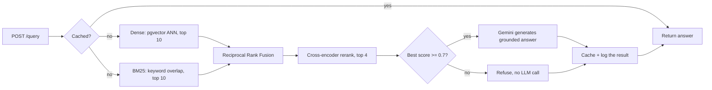
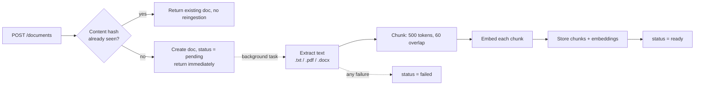

# DocuMind

A multi-tenant document Q&A API. Upload PDFs, Word docs, or text files, ask
questions in plain English, and get answers grounded in the actual content,
with sources cited and a hard refusal when the answer isn't in the documents.

API live at [documind-oyhv.onrender.com](https://documind-oyhv.onrender.com).
Landing page and demo at
[documind-krapansh.vercel.app](https://documind-krapansh.vercel.app).
The backend sleeps after inactivity on Render's free tier, so the first
request can take 30 to 50 seconds.


```bash
curl -X POST https://documind-oyhv.onrender.com/auth/keys \
  -H "Content-Type: application/json" \
  -d '{"tenant_name": "demo"}'

curl -X POST https://documind-oyhv.onrender.com/documents \
  -H "X-API-Key: <key from above>" \
  -F "file=@handbook.pdf"

curl -X POST https://documind-oyhv.onrender.com/query \
  -H "X-API-Key: <key from above>" \
  -H "Content-Type: application/json" \
  -d '{"question": "What is the refund policy?"}'
```

## What makes this different from a tutorial RAG app

- **Tenant isolation lives in SQL**, not in application code. Every query
  filters by `tenant_id` inside the database call itself.
- **Retrieval combines two methods**: dense embeddings and keyword search
  (BM25), instead of trusting one.
- **The system refuses to answer** when it isn't confident, instead of
  letting the model guess.
- **Quality is measured offline** with a real RAGAS evaluation harness,
  not by eyeballing a few examples.

## Architecture

One FastAPI service, layered the way a much bigger system would be: routers
handle HTTP, services hold the logic, repositories are the only code that
touches the database, and clients wrap every external API call. Services
never import SQLAlchemy directly, which is what keeps the retrieval
pipeline testable without a live Postgres instance.


Vectors and metadata live in the same Postgres database through `pgvector`,
not a separate vector store. A document, its chunks, and their embeddings
commit in one transaction, so a chunk can never exist without its
embedding.

## Project layout

```
documind/
├── app/
│   ├── api/routers/          # auth, documents, query, history, eval, health
│   ├── clients/               # Gemini, FlashRank wrappers
│   ├── core/                  # exception hierarchy, security helpers
│   ├── middleware/             # correlation-id, auth, rate-limit
│   ├── models/                 # SQLAlchemy ORM models
│   ├── repositories/           # the only layer allowed to touch the database
│   ├── schemas/                 # Pydantic request/response models
│   ├── services/                 # business logic and orchestration
│   ├── config.py                 # env-driven settings
│   └── main.py                   # app wiring, startup sweep
├── alembic/versions/               # schema migrations
├── eval/
│   ├── golden_corpus/               # 10 fictional source documents
│   ├── golden_dataset.json          # 41 question/answer/category items (v3)
│   ├── run_eval.py                  # CLI entry point for an offline eval run
│   └── RESULTS.md                   # eval history and threshold-tuning notes
├── tests/                             # 18 files, 79 tests, real Postgres
├── frontend/                           # React + Vite landing page and demo
│   ├── src/                             # components, scroll animation, api client
│   └── api/                             # Vercel proxy: session cookie, no client-side key
├── .github/workflows/ci.yml             # GitHub Actions with a real pgvector container
├── Dockerfile / docker-compose.yml / render.yaml
└── requirements.txt
```

## How a query works



Dense retrieval is good at meaning and bad at exact terms, like an error
code. BM25 is the opposite: strong on keyword overlap, blind to
paraphrasing. Reciprocal Rank Fusion combines both rankings by position,
not raw score, since cosine distance and a BM25 score aren't on the same
scale.

The fused results go through a real cross-encoder rerank, too slow for a
whole corpus but cheap for the handful of candidates RRF narrows things
down to. If the best result still scores below the confidence threshold,
the system refuses before calling the model, so a refusal costs nothing
beyond retrieval. The system prompt also tells the model to treat
retrieved text as data, never as instructions, so a document that says
"ignore previous instructions" can't hijack the response.

## How ingestion works



Upload returns immediately with a `pending` status. Chunking, embedding,
and storage happen in a background task, since embedding a large document
can take longer than a client should wait. The client polls
`GET /documents/{id}` until it's `ready` or `failed`. Re-uploading the
same file is a no-op, checked by content hash, so it never wastes an
embedding call twice. Uploads are capped at 20MB and read in small
chunks instead of all at once, since the backend runs on a
memory-limited instance.

## Multi-tenancy

Every table except `tenants` carries a `tenant_id`, and every query
filters on it inside the SQL, not as a check after the data comes back.
A filter applied after the fact is one deleted line away from leaking
another tenant's data. A query that never fetched those rows can't leak
them, no matter what the code around it does. This is tested directly:
two tenants get chunks with the exact same embedding on purpose, so a
passing test proves the `tenant_id` filter is doing the work, not luck.

## Evaluation

A hand-built golden dataset against a fictional ten-document corpus.
`eval/run_eval.py` runs every question through the real retrieval and
answering code, not a copy of it, and scores the results with RAGAS.

| Metric | v2 (30 items) | v3 (41 items) |
|---|---|---|
| Faithfulness | 1.0 | 0.99 |
| Answer relevancy | 0.83 | 0.78 |
| Context precision | 0.79 | 0.73 |
| Refusal accuracy | 6/6 (100%) | 6/8 (75%) |

The confidence threshold came from measured data, not a guess: an
earlier value refused 3 of 6 genuinely unanswerable questions, and
retuning it brought that to 6 of 6 with no change to the 24 answerable
ones. Full history is in [`eval/RESULTS.md`](eval/RESULTS.md).

v2's perfect faithfulness score was real but easy to over-read. Every
v2 answer was close to a verbatim copy of one sentence, and every
refusal question had nothing to do with the corpus at all, so nothing
was tested near its real limit. v3 adds arithmetic the corpus never
states outright, questions that share words with a real sentence but
ask about the case it excludes, cross-document comparisons, multi-hop
questions, and two refusal questions that sit close to real content
instead of being unrelated to it.

The drop in refusal accuracy to 6/8 in v3 is the interesting result.
Both misses are the two new near-miss questions: their overlap with
real content was strong enough to clear the confidence gate before the
model ever ran. But in both cases the model's actual answer was still
correct and honest. It just said so in its own words instead of
matching the exact sentence this check looks for, so the system never
gave a wrong answer, it just paid for a model call it didn't need to.
Faithfulness barely moved even under arithmetic and multi-hop
questions. Full breakdown, including why context precision dropped, is
in [`eval/RESULTS.md`](eval/RESULTS.md).

## Security and reliability

- **The public demo used to share one API key** across every visitor.
  Since retrieval is scoped by tenant, that meant one shared tenant, so
  any visitor could see any other visitor's uploads. Fixed with a
  same-origin proxy that mints a fresh, isolated tenant per visitor and
  keeps the key in an httpOnly cookie the browser never sees.
- **The demo-session endpoint is rate-limited by IP**, and that IP has
  to come from a header the proxy sets, checked against a secret only
  the proxy knows. Without that check, a caller could forge a fresh IP
  on every request and dodge the limit. The proxy itself used to trust
  the wrong end of that header; it now trusts the end a caller can't
  forge.
- **A hard cap limits how many demo tenants can exist at once**, on top
  of the per-IP limit, since each one copies the sample corpus and an
  unbounded number of visitors means unbounded storage growth.
- **`POST /auth/keys` is now rate-limited and length-bounded** too. It
  has no key to check yet, same as the demo endpoint, so nothing else
  stopped a script from minting unlimited tenants for free.
- **`POST /eval/runs` is closed to demo tenants.** It ingests the
  golden corpus and calls the model for real, and demo tenants are
  free to create, so leaving it open would let anyone burn through the
  quota.
- **A generation failure returns a clean 503** and is still logged,
  instead of an unhandled error that left no trace. The streaming
  endpoint got the same fix: a failure partway through now sends an
  explicit error event instead of just cutting off.
- **Ephemeral tenants are swept on every boot**, on top of the sweep
  that already runs on new demo traffic, since Render has no cron job
  and an idle instance would otherwise never clean up.
- **The reranker used to be a PyTorch model** that cost about 555MB of
  memory to load, over Render's free tier limit. Swapped for
  `flashrank`, an ONNX version of the same kind of model, which costs
  about 120MB.

## Tech stack

- **API**: FastAPI, Pydantic
- **Database**: PostgreSQL with `pgvector`, SQLAlchemy, Alembic
- **Retrieval**: pgvector cosine similarity (dense), `rank-bm25` (sparse),
  Reciprocal Rank Fusion, FlashRank (ONNX cross-encoder rerank)
- **LLM and embeddings**: Google Gemini (`gemini-embedding-001`,
  `gemini-3.1-flash-lite`)
- **Evaluation**: RAGAS, against a hand-built golden dataset
- **Testing**: pytest, real Postgres in CI, not a mocked DB
- **Deployment**: Docker, Render

## API overview

| Endpoint | Purpose |
|---|---|
| `POST /auth/keys` | Create a tenant and issue an API key |
| `POST /auth/keys/revoke` | Revoke the calling key (self-service only) |
| `POST /auth/demo-session` | Mint an ephemeral, isolated tenant for the public demo |
| `POST /documents` | Upload a document (`.txt`, `.pdf`, `.docx`) |
| `GET /documents` | List the requesting tenant's documents |
| `GET /documents/{id}` | Check ingestion status |
| `DELETE /documents/{id}` | Delete a document and its chunks |
| `POST /query` | Ask a question, get an answer with cited sources |
| `GET /query/stream` | Same as above, streamed token by token over SSE |
| `GET /history/{session_id}` | Prior questions and answers in a session |
| `POST /eval/runs` | Kick off an offline RAGAS evaluation run |
| `GET /eval/runs/{id}` | Read back a completed evaluation run's scores |

Every endpoint except `/auth/keys`, `/auth/demo-session`, and `/health`
requires an `X-API-Key` header. Interactive docs are at `/docs` on any
running instance.

## Running locally

```bash
docker compose up -d          # Postgres + pgvector on port 5433
python -m venv venv
venv\Scripts\activate         # or `source venv/bin/activate` on Linux/macOS
pip install -r requirements.txt
alembic upgrade head
uvicorn app.main:app --reload
```

You'll need a `.env` with `DATABASE_URL` and `GEMINI_API_KEY` set. See
`.env.example`.

## Running tests

```bash
pytest -m "not live_api"
```

79 tests, run against a real Postgres instance with the schema built by
the actual `alembic upgrade head` chain, not a shortcut that only checks
today's model definitions. They cover multi-tenant isolation, the full
retrieval funnel, ingestion, caching, rate limiting, the refusal path,
and the ephemeral demo tenant lifecycle. One test is marked `live_api`
and hits the real Gemini embedding endpoint as a smoke test; it's
excluded from CI since it costs real quota and isn't deterministic.

## Known limitations at real scale

- The query cache and rate limiters live in one process's memory. Fine
  for one instance, wrong the moment there's more than one. A real
  deployment needs Redis or something like it.
- BM25 rebuilds its index from scratch on every query, since the
  library has no persistent index. Fine at this scale; at real scale
  this would move into Postgres itself with a `tsvector` column and a
  GIN index.
- The reranker's model downloads on first use instead of shipping
  inside the Docker image, to keep the image small and cold starts
  light.
- There's no per-document filter on queries. Every query searches a
  tenant's whole corpus. That's a deliberate choice, not an oversight.
- The vector index is shared across all tenants instead of split per
  tenant, and the tenant filter is applied after the index search
  finds candidates, not before. At real scale, with many tenants in
  one table, a tenant with few chunks can get worse search results
  than one with many chunks. Invisible at this scale; the fix is
  per-tenant indexes.
